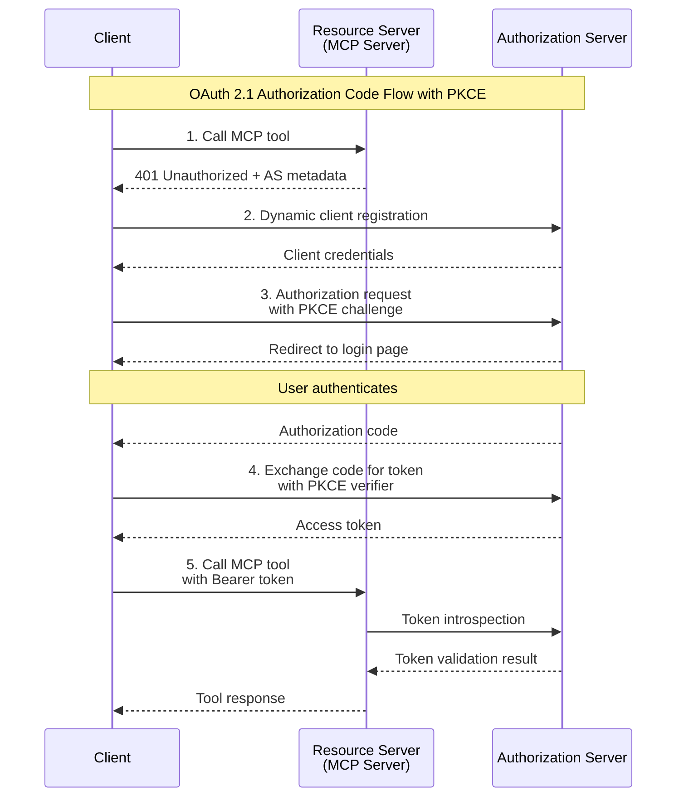

# Secure an MCP server with OAuth 2.1

Learn how to build an MCP server with OAuth 2.1 authentication, starting from a simple server and progressively adding security layers through a physically separated authorization service.

OAuth 2.1 provides the industry-standard framework for delegated authorization, enabling secure three-party interactions between clients, MCP servers, and authorization services.

-   :material-server:{ .lg .middle } __01&nbsp;&nbsp;Basic resource server__

    ---

    Create a standalone MCP server with FastMCP that serves as the foundation for secure authentication

    [:octicons-arrow-right-24: Start building](01-basic-resource-server.md)

-   :material-shield-account:{ .lg .middle } __02&nbsp;&nbsp;Authorization server foundation__

    ---

    Build a separate OAuth 2.1 authorization server with clean architecture and well-defined service boundaries

    [:octicons-arrow-right-24: Create AS structure](02-authorization-server-foundation.md)

-   :material-lock-open:{ .lg .middle } __03&nbsp;&nbsp;OAuth flow implementation__

    ---

    Implement the complete Authorization Code flow with PKCE, login UI, and token issuance

    [:octicons-arrow-right-24: Add authentication](03-oauth-flow-implementation.md)

-   :material-lock:{ .lg .middle } __04&nbsp;&nbsp;Secure resource server__

    ---

    Protect your MCP server with token verification and refactor for clean separation of concerns

    [:octicons-arrow-right-24: Secure the server](04-secure-resource-server.md)

-   :material-account-check:{ .lg .middle } __05&nbsp;&nbsp;Test client__

    ---

    Build a client that orchestrates the complete three-party OAuth flow with streamable HTTP transport

    [:octicons-arrow-right-24: Test the flow](05-test-client.md)

-   :material-database:{ .lg .middle } __06&nbsp;&nbsp;Persistence, scopes, and config__

    ---

    Enhance both services with persistent storage, token scopes, and configuration management

    [:octicons-arrow-right-24: Add enhancements](06-persistence-scopes-and-config.md)

## What you'll build

By the end of this tutorial series, you'll have created:

- **Resource Server**: A FastMCP server with public and protected tools, token verification middleware, and clean layered architecture
- **Authorization Server**: A separate OAuth 2.1 server handling login, authorization, and token management
- **Test Client**: A complete client demonstrating the three-party OAuth flow with automatic token handling
- **Enhanced features**: Service separation, configuration management, and OAuth security patterns

## Prerequisites

Before starting this tutorial series, you should have:

- Python 3.12+
- [uv](https://docs.astral.sh/uv/) package manager
- Basic familiarity with MCP concepts and FastMCP

## Architecture overview

The tutorial builds a complete OAuth 2.1 system with three components:

## Learning approach

Each tutorial in this series:

1. **Starts simple**: Begin with working code you can run immediately
2. **Builds incrementally**: Add one concept at a time with clear explanations
3. **Maintains testability**: Every step produces a runnable, testable system
4. **Emphasizes clarity**: Code organization that teaches architectural principles
5. **Provides checkpoints**: Verification steps to ensure your implementation works

## Get the code

You can get a completed version of the project that you build in this tutorial series on GitHub:

[github.com/mmacy/mcp-server-demo](https://github.com/mmacy/mcp-server-demo)
